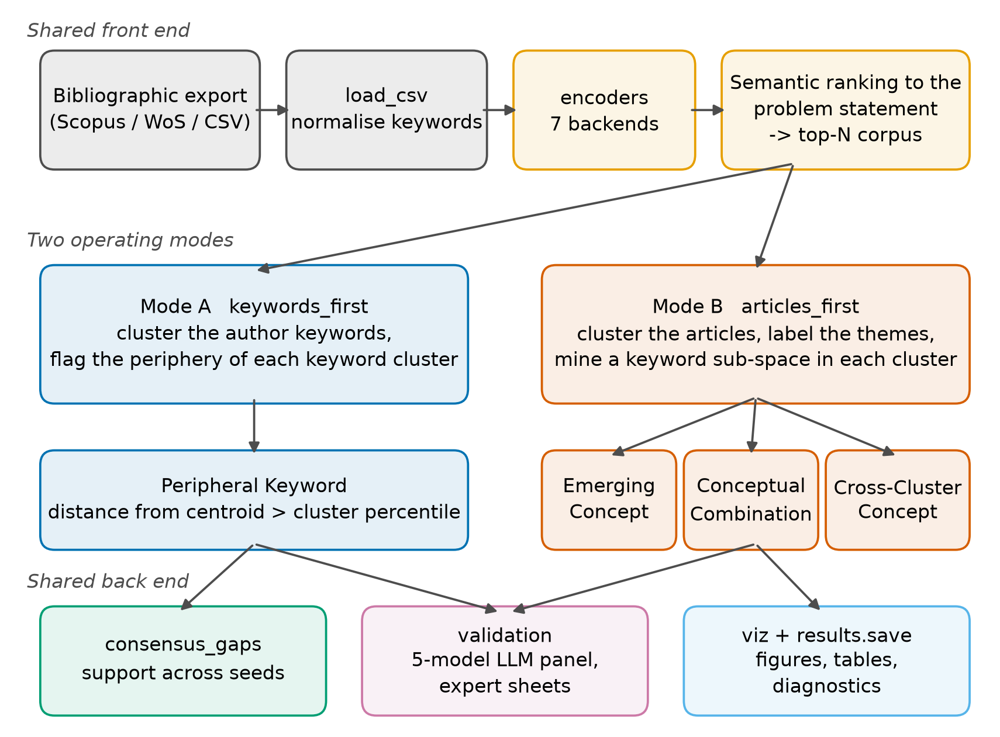
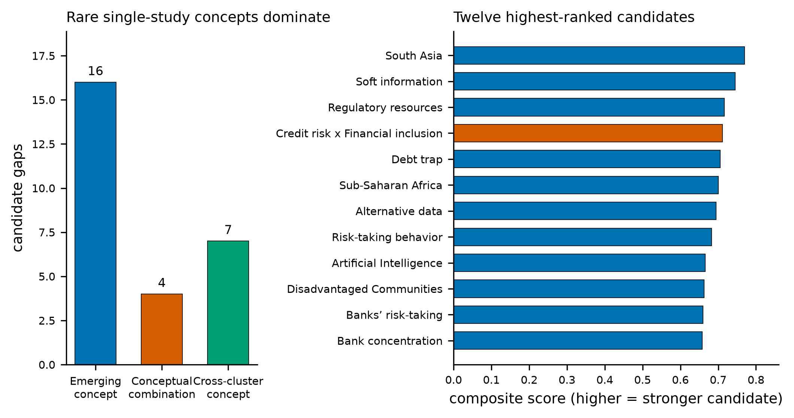
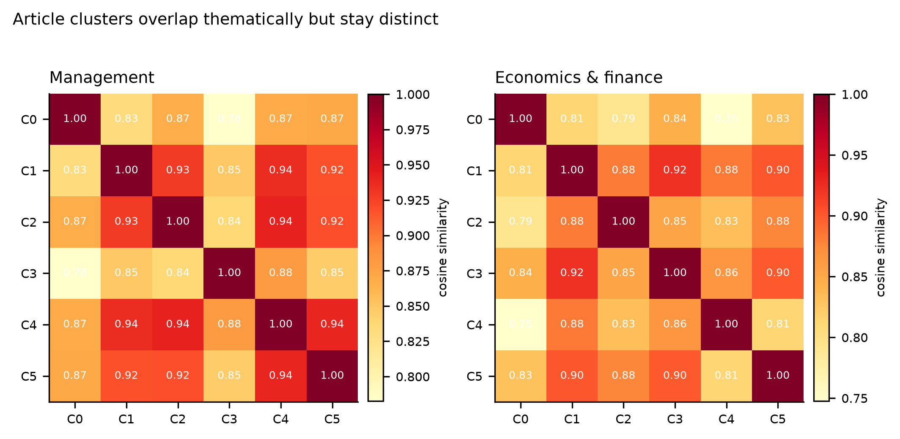

# EmbedResearchGaps: embedding-driven identification of research gaps in author-keyword space

**Sebastian Matysik** ^a,\*^, **Joanna Wiśniewska** ^b^, **Paweł Karol Frankowski** ^c,d^

^a^ Doctoral School, Institute of Management, University of Szczecin, Cukrowa 8, 71-004 Szczecin, Poland
^b^ Institute of Management, University of Szczecin, Cukrowa 8, 71-004 Szczecin, Poland
^c^ Faculty of Computer Science and Telecommunications, Maritime University of Szczecin, Wały Chrobrego 1-2, 70-500 Szczecin, Poland
^d^ Faculty of Electrical Engineering, West Pomeranian University of Technology in Szczecin, Sikorskiego 37, 70-313 Szczecin, Poland

\* Corresponding author. E-mail address: sebastian.matysik@usz.edu.pl

## Abstract

EmbedResearchGaps identifies candidate research gaps in the author-keyword
space of a screened literature corpus. It implements two published procedures:
clustering author keywords and flagging each cluster's periphery, or clustering
articles first and then mining each cluster's keyword sub-space for emerging
concepts, unrealised conceptual combinations and cross-cluster concepts. It adds
seven embedding backends, a five-provider annotation panel, blinded expert
sheets and a consensus mode pooling candidates across k-means seeds and corpus
sizes. In two Scopus case studies candidate sets were sensitive to both and the
ranking added no reliable novelty enrichment over lexical filtering, so the
software reports support explicitly and treats candidates as hypotheses for
expert screening.

**Keywords:** research gaps; semantic embeddings; keyword clustering;
literature review; bibliometrics; reproducibility

## Metadata

**Table 1.** Code metadata.

| Nr | Code metadata description | Metadata |
|----|---------------------------|----------|
| C1 | Current code version | v1.0.0 |
| C2 | Permanent link to code/repository used for this code version | https://github.com/s-matysik/EmbedResearchGaps/releases/tag/v1.0.0 |
| C3 | Legal code license | MIT License |
| C4 | Code versioning system used | git |
| C5 | Software code languages, tools and services used | Python (>= 3.10); numpy, pandas, scipy, scikit-learn, matplotlib, networkx, kneed, typer; optional sentence-transformers, krippendorff, openpyxl; optional HTTP access to the OpenAI, Nomic, Jina and Cohere embedding endpoints and to the OpenAI, Anthropic, Google, DeepSeek and xAI chat endpoints |
| C6 | Compilation requirements, operating environments and dependencies | Pure Python 3.10 or newer, no compilation: `pip install embedresearchgaps` (or `pip install -e .` from the repository). Runs fully offline with the built-in `tfidf-svd` backend; remote backends read API keys from named environment variables |
| C7 | If available, link to developer documentation/manual | https://github.com/s-matysik/EmbedResearchGaps#readme |
| C8 | Support email for questions | sebastian.matysik@usz.edu.pl |

## 1. Motivation and significance

Formulating a research gap is the step of a systematic literature review that
has resisted automation most stubbornly. It is normally done by expert reading
[1], and the categories a gap can fall into have been formalised for systematic
reviews [2] without the identification itself becoming mechanical; the
organisational-research literature argues further that gap-spotting is a weak
way of constructing a research question when it is not disciplined by evidence
[3]. Reporting standards specify how a review must be documented [4] but not
how its research agenda is arrived at. Screening, by contrast, has been
automated repeatedly, by active-learning frameworks [5] and by embedding-based
ranking: EmbedSLR ranks candidate articles by the cosine distance between an
embedded research question and embedded titles and abstracts, and validates the
resulting set bibliometrically [6], with a multi-model consensus procedure
added in version 2.0 [7]. Once a reviewer holds a screened corpus, the question
changes from *which papers belong here* to *what do these papers not talk
about*, and the usual answer is an unaided reading of discussion sections.

Author keywords are an attractive substrate for that second question. They are
assigned by the authors themselves, they are short enough to embed without
truncation, and their co-occurrence structure underpins a large bibliometric
literature with established tooling — VOSviewer [8], bibliometrix [9] and
CiteSpace [10] — and established reporting conventions [11]. That tooling
visualises structure and leaves the reading to the analyst; work that detects
emerging topics does so from citation and term-burst signals rather than from a
semantic space [12]. Substituting contextual sentence embeddings [13,14] for
term co-occurrence makes the semantic neighbourhood of a keyword computable,
and embedding-based clustering separates short texts more coherently than
bag-of-words representations [15].

Two procedures for turning that structure into candidate gaps were introduced
recently. The first clusters the author keywords of a screened corpus and
treats the semantic periphery of each keyword cluster as the interesting
region, on the argument that a term far from its own cluster centroid is
attached to the field only loosely [16]. The second clusters the articles
first, labels each cluster, and then mines a keyword sub-space inside every
cluster with three detectors: rare and lexically salient terms (emerging
concepts), pairs of established terms that never co-occur (conceptual
combinations), and terms established elsewhere in the corpus but absent from
this cluster (cross-cluster concepts) [17]. Both were validated with a panel of
large language models annotating keywords against a calibrated rubric — a
design supported by evidence that language models match or exceed human coders
on well-defined annotation tasks [18–20] — and the second additionally against
two human experts [17].

Neither procedure was released as software. Both existed as notebooks in which
model choice, thresholds and API credentials were interleaved with the
analysis, which makes a published run impossible to repeat and a new corpus
expensive to analyse. EmbedResearchGaps turns them into one library with a
single configuration object, interchangeable embedding backends, and a
validation layer that is part of the package rather than an appendix to it. It
also adds what the prototypes lacked: a measurement of how far a candidate
list survives re-initialisation of the clustering it rests on.

The intended user is a reviewer who has already screened a corpus — with
EmbedSLR, a database query, or by hand — and wants a ranked, auditable list of
directions the corpus leaves open. The workflow is: export from Scopus or Web
of Science, load, state the research problem in one or two sentences, choose a
backend, run one or both modes, and read the candidate table. Every candidate
carries its source articles, the metric values behind its score, and a one-line
rationale.

## 2. Software description

### 2.1 Software architecture

Fig. 1 shows the architecture. A shared front end loads a bibliographic export,
resolves the Scopus and Web of Science column conventions, normalises author
keywords, embeds the texts with the selected backend and — when a research
problem is supplied — ranks the records by cosine distance to it and truncates
the corpus to the *N* nearest. Two modes then operate on that analysis corpus,
and a shared back end handles consensus, validation and output.

The package holds twelve top-level modules and a `validation` subpackage of
five: `config` (dataclasses carrying every threshold, weight and seed),
`corpus`, `text` (keyword normalisation, the methodological-term filter,
corpus-level TF-IDF salience), `encoders`, `clustering` (semantic ranking,
k-selection, k-means with per-cluster centroid distances), `keywords`, `gaps`
(the four detectors and three scoring formulae), `results`, `pipelines`,
`consensus`, `viz` and `cli`; the subpackage holds the annotation protocol, the
annotator backends, the agreement metrics, the study runner and the expert
sheets. Runs are deterministic: one `RunConfig` fixes every threshold, weight
and seed, and `PipelineResult.save()` writes it next to the tables, so a
published result can be regenerated from the artefacts alone.

### 2.2 Software functionalities

**Two operating modes.** `keywords_first` embeds and clusters the unique author
keywords of the analysis corpus, then flags keywords whose distance from their
own cluster centroid exceeds a cluster-specific percentile (95 by default);
because the threshold is computed inside each cluster, clusters of different
semantic density are judged on their own scale. `articles_first` clusters the
articles, labels each cluster from its most frequent non-core keywords, builds
a keyword sub-space inside every cluster, and applies the three detectors, each
with its own composite score. Both modes share the filters that remove terms
peripheral for uninteresting reasons: a frequency ceiling, a token-count rule,
a methodological blocklist of some fifty phrases and acronyms, and a
core-domain filter dropping the terms that define the field itself.

**Seven embedding backends.** `tfidf-svd` is offline, deterministic and needs
no credentials; `sbert` runs any sentence-transformers checkpoint locally;
`openai`, `nomic`, `jina` and `cohere` call hosted endpoints; `precomputed`
accepts user-supplied vectors, which is how a published run is repeated without
re-embedding. All conform to one contract that validates the returned row count
and rejects non-finite vectors, so a silent misalignment between a keyword and
its embedding cannot occur. API keys are read from named environment variables
and never enter a configuration object, a result file or a log.

**Database-agnostic input.** `load_csv` resolves canonical fields through an
alias table covering the Scopus CSV export, the Scopus Search API and both Web
of Science export flavours — two-letter field tags and spelled-out headers — so
none needs a column map; any other export is accommodated by passing one. Web
of Science `Keywords Plus` is deliberately not treated as author keywords,
because those terms are assigned by the database rather than the authors; a
user who wants them must ask explicitly. The test suite loads all three
flavours and asserts they yield an identical corpus.

**Stability-aware consensus.** `consensus_gaps` repeats a mode across k-means
seeds and, optionally, across analysis-corpus sizes, and reports for every
candidate the fraction of runs that produced it, together with the pairwise
overlap of the candidate sets, decomposed into the overlap attributable to the
seed alone and the overlap across corpus sizes. Filtering on that support turns
a single-run list into a ranking whose reproducibility is measured rather than
assumed; Section 3 shows why this is necessary. A partition whose silhouette
[21] falls below 0.10 additionally raises a `LOW_CLUSTER_SEPARATION` warning
naming the measured value.

**Validation.** The `validation` subpackage implements the annotation protocol
of the source papers: a keyword is labelled `GAP`, `EXPLORED`, `LOW
IMPORTANCE`, `METHOD` or `NOISE` and given a Novelty Score from 1 to 10 against
a rubric supplied verbatim in the prompt. Six chat providers are registered and
called at temperature 0 where the model accepts it; the study of Section 3.3
uses five. `CallableAnnotator` wraps any local function, and a failing
annotator is recorded rather than allowed to abort the study. The module
computes label rates, Novelty distributions, Fleiss' kappa, Krippendorff's
alpha, pairwise agreement, and the comparison between the candidate set and a
control set with a Welch t-test, a Mann-Whitney U test, Cohen's d and a
permutation test on the difference of means. `selected_and_control_keywords`
builds a control set *disjoint* from the candidates, and `compare_keyword_sets`
refuses parametric p-values when the two arms share a keyword, because a
two-sample statistic on nested samples has no defined null distribution.
Blinded expert sheets — rows shuffled, gap types and scores withheld — are
written as a workbook and read back into a Spearman concordance against the
panel.

**Figures and diagnostics.** Seven figures are produced head-lessly, and every
run returns the diagnostics a methods section needs: cluster sizes and quality
indices, the k-selection trace, the TF-IDF match-type breakdown, core-domain
terms, deduplication counts and the encoder descriptions.

## 3. Illustrative examples

Two corpora were retrieved from Scopus, restricted to English-language journal
articles in the business, economics and decision-science subject areas, and
analysed with `text-embedding-3-large`, *N* = 50 and otherwise default
settings. The management corpus holds 493 records matching *dynamic
capabilit\** and *digital transformation*, analysed against "How do dynamic
capabilities enable the digital transformation of established firms?"; the
economics and finance corpus holds 487 records matching *fintech* or *financial
technology* together with *financial inclusion*, *credit risk* or *bank
lending*, analysed against "How does fintech credit affect financial inclusion
and credit risk in banking systems?". A third corpus of 290 records on
gamification in marketing served as a conformance check against the topic of
the source publications. Queries, corpora, every reported table and the
regeneration scripts are deposited with the release [22].

### 3.1 What the modes return

On the management corpus, k-selection chose *k* = 6 for both modes by the elbow
rule, because the best silhouette over the candidate range (0.041 for the
article space, 0.065 for the keyword space) fell below the 0.25 floor. From the
146 unique author keywords, Mode B returned 27 candidate entries covering 26
distinct keywords — 18 emerging concepts, 7 cross-cluster concepts and 2
conceptual combinations — and Mode A returned 6 peripheral keywords, 4.1 % of
its keyword space (Fig. 2). The highest-ranked candidates are single-study
terms such as *Agrifood businesses*, *Automotive industry* and *DT vision*, and
the sole high-ranked combination pairs *Dynamic capabilities* with *Industry
4.0*: two established terms of the same cluster that never co-occur in one
record.

On the economics and finance corpus (168 unique author keywords, *k* = 6 for
both modes), Mode B returned 27 entries (16 emerging, 7 cross-cluster and 4
combinations) and Mode A returned 4, 2.4 % of its keyword space. Fig. 3 shows
the type distribution and the twelve highest-ranked candidates, headed by
*South Asia*, *Soft information* and *Regulatory resources*, with *Credit risk
× Financial inclusion* as the strongest combination. Fig. 4 shows that the six
article clusters of each corpus overlap thematically without collapsing into
one another.

The type distribution is dominated by emerging concepts in every corpus,
reproducing the pattern reported for the articles-first procedure [17]. The
candidates are a mixture of genuine research directions, contextual scope terms
(*South Asia*, *Sub-Saharan Africa*) and — in one management record — two
personal names that a metadata error had placed in the author-keyword field,
neither of them the article's author. The panel labelled those names `NOISE`
with a Novelty Score of 1, which is what a validation layer exists to produce:
the pipeline surfaces what the metadata contains, and the layer above catches
what should not have been there.

### 3.2 How stable the candidate lists are

Fig. 5 quantifies stability. Re-running a mode with five k-means seeds and
nothing else changed, the candidate sets overlap by a mean pairwise Jaccard
index of 0.44 (Mode B) and 0.14 (Mode A) on the management corpus, and 0.38 and
0.15 on the economics and finance corpus; the worst Mode A seed pair shares no
candidate at all. Changing the corpus size from *N* = 50 to *N* = 30, 100 or
150 leaves overlaps of 0.09 to 0.31 against the *N* = 50 reference for Mode B
and 0.00 to 0.38 for Mode A — the zero being the economics and finance corpus
at *N* = 150, whose eight candidates have nothing in common with the four found
at *N* = 50. Because *N* is as arbitrary as the seed, `consensus_gaps` pools
over both: across five seeds and four sizes, twenty runs per mode, the mean
pairwise overlap is 0.23 and 0.19 for Mode B on the two corpora, and the
decomposition separates the sources — 0.45 and 0.39 between runs sharing a
size, against 0.18 and 0.14 between runs that do not. The corpus size moves the
candidate list more than the seed does.

Pooling is what makes a list reportable. Of 161 distinct candidates produced
across the twenty management Mode B runs, 12 reach majority support and 2 are
unanimous; for economics and finance the figures are 166, 11 and 2. Mode A
pools to 50 and 37 candidates with 2 and 1 at majority support and none
unanimous — a quantitative statement that its single-run output should not be
read as a ranking at all. High support is not validity, though: the two
personal names left in the management keyword field by a metadata error reach
support of 0.85 and 0.75, because a data defect is perfectly reproducible,
which is why the package ships the validation layer as well.

### 3.3 What the panel says

Five providers (GPT-4o, Claude Sonnet 4.6, DeepSeek V4 Pro, Grok 4.5 and
Gemini 2.5 Flash) annotated every candidate and every author keyword of the
analysis corpus at temperature 0 — between 758 and 990 judgements per corpus
and mode. The control arm is the keyword population *minus* the candidates: the
arms must be disjoint, or the candidates contribute to both and no two-sample
statistic has a defined null distribution.
Inter-annotator reliability on the candidate sets was moderate (Fleiss' κ
0.45–0.70; Krippendorff's α on the Novelty Score 0.38–0.85). Holding two models
out and correlating their mean Novelty Score against that of the remaining
three gave Spearman ρ between 0.64 and 0.83 on the Mode B candidate sets; on
Mode A the coefficient rests on four to six keywords and is uninterpretable.
This is a model-against-model check exercising the same concordance code path
as an expert study, not a substitute for one.

Against that control (Fig. 6, left) the six comparisons point in different
directions. Mode B candidates are labelled `GAP` more often than control
keywords on the economics and finance corpus (+12.7 pp, mean Novelty Score
+12.5 %, Welch *p* = 0.032, Mann-Whitney *p* = 0.014, permutation *p* = 0.046,
*d* = 0.21) and less often on management (−1.2 pp) and gamification (−9.1 pp);
Mode A is negative on all three (−8.0, −9.3, −3.5 pp). One nominally
significant result out of six pre-planned comparisons is what chance produces:
under Holm correction across the six, nothing survives (smallest adjusted
*p* = 0.19). We therefore read the panel as showing no reliable novelty
enrichment, with a single corpus-and-mode combination worth re-testing on an
independent corpus rather than a demonstrated effect.

The panel is not the only evidence on this method, and the earlier evidence is
more favourable. The AMCIS study validated its candidates against two human
experts as well as the panel: an associate professor and a full professor, each
with more than twenty years in the field of the corpus, independently scored
the sixteen candidates the pipeline produced. Three of them — *social commerce*,
*time poverty* and *psychological distance* — were labelled `GAP` unanimously
by all five models and corroborated as gaps by at least one expert, and expert
mean Novelty Scores correlated with the panel's at Spearman ρ = 0.61
(*p* = 0.012, *n* = 16) [17]. That study also found the spread of expert opinion
wider than the spread across models, and described its expert arm as a pilot to
be replaced by a larger calibrated study. A sixteen-keyword pilot on one
marketing corpus and a panel study on three corpora in two other domains are
different measurements, and the disagreement between them is what that larger
study is needed to resolve. We did not repeat it — an expert study is a study
of people, not of software — so the package ships the instrument instead, and
the blinded sheets for all three corpora are in the supplementary material.

A filter-eligible comparison locates where what little signal there is comes
from. The *eligible pool* is every keyword that passes all filters but that the
ranking did not select; the remaining keywords fail at least one filter.
Comparing the pool against those failing keywords isolates the filters, and
comparing the candidates against the pool isolates the ranking applied on top
of them (Fig. 6, right). The filters raise the GAP rate by 7.8 pp on management
and 10.6 pp on economics and finance, and mean novelty by 8.3 % and 9.2 %
(permutation *p* = 0.149 and 0.069) — consistent in sign and size on both
corpora. The ranking then moves the GAP rate by −6.1 pp and +6.8 pp and novelty
by −8.4 % and +8.6 % (permutation *p* = 0.192 and 0.150) — inconsistent in
sign. On these corpora the filters carry whatever enrichment exists, and the
periphery criterion adds nothing the panel can detect.

## 4. Impact

The immediate impact is that two published procedures become executable. A
reviewer who wants to apply either now installs a package, writes ten lines,
and obtains a candidate table with a rationale and source articles for every
row, instead of transcribing a notebook and re-entering credentials. The
`precomputed` backend plus the saved `RunConfig` make a published run
repeatable at zero embedding cost, which turns a gap list into evidence a
reviewer can be asked about.

The methodological impact is the measurement the prototypes did not report.
Because EmbedResearchGaps makes both the seed and the corpus size explicit
parameters and pools across them, the instability documented in Section 3.2
becomes visible and reportable rather than hidden behind a default, and the
`LOW_CLUSTER_SEPARATION` warning tells a user when their partition is too weak
to read a single-run ranking off. Any future work that ranks candidates from a
k-means partition of an author-keyword space now has both a baseline to beat
and an instrument that measures whether it beat it. The filter-eligible
comparison of Section 3.3 is the same kind of instrument for effect
attribution: it distinguishes "our filters are sensible" from "our ranking
works", and it is available to anyone extending either procedure.

Because the ranking adds no detectable enrichment over the filters and the
lists move with the initialisation, a candidate table from this package is a
generator of hypotheses for expert screening, not an inventory of established
omissions. The software is built for that use: every candidate carries a
rationale, its source articles and its support across runs, and the validation
subpackage and the expert sheets give the screening step instruments too.

EmbedResearchGaps is complementary to EmbedSLR [6,7] rather than incremental:
EmbedSLR decides which articles enter a review by ranking document-level
embeddings against inclusion criteria, whereas EmbedResearchGaps takes an
already-screened corpus and mines the *author-keyword* space of the accepted
articles for what they do not discuss, returning typed candidates with
stability support. It is likewise not a bibliometric mapping tool: VOSviewer
and bibliometrix visualise co-occurrence structure and leave interpretation to
the reader, whereas EmbedResearchGaps applies explicit, parameterised criteria
to produce a ranked, auditable list with a measured reproducibility — and
reports when that reproducibility is poor. The validation subpackage is
reusable on its own, on any keyword list whatever produced it.

## 5. Conclusions

EmbedResearchGaps implements, tests and documents two embedding-based
procedures for identifying candidate research gaps in author-keyword space,
with interchangeable embedding backends, a five-provider validation panel,
expert sheets, and cross-process determinism enforced by the test suite (315
tests, 93 % statement coverage).

Applied to two new Scopus corpora, the software reproduces the mechanics and
the candidate-type distribution of the published procedures, and shows two
limits users should plan around: candidate lists are sensitive both to the
k-means initialisation and to the corpus size, and the semantic ranking adds no
reliable novelty enrichment beyond the lexical and frequency filters. We
therefore recommend running the articles-first mode through `consensus_gaps`
across at least five seeds and several corpus sizes, reporting support with
every candidate, and treating the output as hypotheses for expert screening
rather than a ranking to be read off. Work in progress extends consensus across
embedding models and replaces k-means with a density-based partition whose
stability does not depend on an initialisation.

## Declaration of generative AI and AI-assisted technologies in the manuscript preparation process

During the preparation of this work the authors used Claude (Anthropic) in
order to assist with implementing and testing the software, running the
reported analyses and drafting and editing the manuscript. After using this
tool, the authors reviewed and edited the content as needed and take full
responsibility for the content of the published article. No AI tool is listed
as an author. The figures are data visualisations produced by the package's own
plotting code from the deposited result tables; no primary observed or
experimental image was created or altered with AI tools.

## CRediT authorship contribution statement

**Sebastian Matysik:** Conceptualization, Methodology, Software, Validation,
Formal analysis, Data curation, Visualization, Writing – original draft,
Writing – review and editing. **Joanna Wiśniewska:** Conceptualization,
Methodology, Validation, Supervision, Writing – review and editing. **Paweł
Karol Frankowski:** Conceptualization, Methodology, Software, Validation,
Writing – review and editing.

## Declaration of competing interest

The authors declare that they have no known competing financial interests or
personal relationships that could have appeared to influence the work reported
in this paper.

## Funding

This research did not receive any specific grant from funding agencies in the
public, commercial, or not-for-profit sectors.

## Data availability

The three corpora, all candidate and validation tables, the figure sources and
the scripts that regenerate every reported number are deposited in the software
release [22], under `data/` and `paper/`; the panel's annotation judgements are
included in full. The corpora are Scopus records retrieved through the Scopus
Search API, and `data/README.md` gives the queries and retrieval dates, so a
reader with Scopus access can re-retrieve them.

## Acknowledgements

The authors thank the two anonymous domain experts who took part in the expert
validation of the antecedent study [17].

## References

[1] Westgate MJ, Barton PS, Pierson JC, Lindenmayer DB. Text analysis tools for
identification of emerging topics and research gaps in conservation science.
Conserv Biol 2015;29:1606-14. https://doi.org/10.1111/cobi.12605.

[2] Robinson KA, Saldanha IJ, McKoy NA. Development of a framework to identify
research gaps from systematic reviews. J Clin Epidemiol 2011;64:1325-30.
https://doi.org/10.1016/j.jclinepi.2011.06.009.

[3] Sandberg J, Alvesson M. Ways of constructing research questions:
gap-spotting or problematization? Organization 2011;18:23-44.
https://doi.org/10.1177/1350508410372151.

[4] Page MJ, McKenzie JE, Bossuyt PM, Boutron I, Hoffmann TC, Mulrow CD, et al.
The PRISMA 2020 statement: an updated guideline for reporting systematic
reviews. BMJ 2021;372:n71. https://doi.org/10.1136/bmj.n71.

[5] van de Schoot R, de Bruin J, Schram R, Zahedi P, de Boer J, Weijdema F, et
al. An open source machine learning framework for efficient and transparent
systematic reviews. Nat Mach Intell 2021;3:125-33.
https://doi.org/10.1038/s42256-020-00287-7.

[6] Matysik S, Wiśniewska J, Frankowski PK. EmbedSLR: an open-source python
framework for efficient embedding-based screening and bibliometric validation
in systematic literature review. SoftwareX 2025;32:102416.
https://doi.org/10.1016/j.softx.2025.102416.

[7] Matysik S, Wiśniewska J, Frankowski PK. Version 2.0 - EmbedSLR: an
open-source python framework for efficient embedding-based screening and
bibliometric validation in systematic literature review. SoftwareX
2026;34:102563. https://doi.org/10.1016/j.softx.2026.102563.

[8] van Eck NJ, Waltman L. Software survey: VOSviewer, a computer program for
bibliometric mapping. Scientometrics 2010;84:523-38.
https://doi.org/10.1007/s11192-009-0146-3.

[9] Aria M, Cuccurullo C. bibliometrix: an R-tool for comprehensive science
mapping analysis. J Informetr 2017;11:959-75.
https://doi.org/10.1016/j.joi.2017.08.007.

[10] Chen C. CiteSpace II: detecting and visualizing emerging trends and
transient patterns in scientific literature. J Am Soc Inf Sci Technol
2006;57:359-77. https://doi.org/10.1002/asi.20317.

[11] Donthu N, Kumar S, Mukherjee D, Pandey N, Lim WM. How to conduct a
bibliometric analysis: an overview and guidelines. J Bus Res 2021;133:285-96.
https://doi.org/10.1016/j.jbusres.2021.04.070.

[12] Small H, Boyack KW, Klavans R. Identifying emerging topics in science and
technology. Res Policy 2014;43:1450-67.
https://doi.org/10.1016/j.respol.2014.02.005.

[13] Devlin J, Chang MW, Lee K, Toutanova K. BERT: pre-training of deep
bidirectional transformers for language understanding. In: Proceedings of
NAACL-HLT 2019. Minneapolis: Association for Computational Linguistics; 2019,
p. 4171-86. https://doi.org/10.18653/v1/N19-1423.

[14] Reimers N, Gurevych I. Sentence-BERT: sentence embeddings using Siamese
BERT-networks. In: Proceedings of EMNLP-IJCNLP 2019. Hong Kong: Association for
Computational Linguistics; 2019, p. 3980-90.
https://doi.org/10.18653/v1/D19-1410.

[15] Petukhova A, Matos-Carvalho JP, Fachada N. Text clustering with large
language model embeddings. Int J Cogn Comput Eng 2025;6:100-8.
https://doi.org/10.1016/j.ijcce.2024.11.004.

[16] Frankowski PK, Wiśniewska J, Matysik S. Automated identification of
research gaps using keyword clustering and an embedding model. In: PACIS 2026
Proceedings, paper 7.
https://aisel.aisnet.org/pacis2026/adv_theory/adv_theory/7 [accessed 13
September 2026].

[17] Frankowski PK, Wiśniewska J, Matysik S. Semantic periphery detection in
academic keyword space: an embedding-driven framework for automated research
gap identification. In: AMCIS 2026 Proceedings, paper 7.
https://aisel.aisnet.org/amcis2026/ai_aiaa/ai_aiaa/7 [accessed 13 September
2026].

[18] Gilardi F, Alizadeh M, Kubli M. ChatGPT outperforms crowd workers for
text-annotation tasks. Proc Natl Acad Sci U S A 2023;120:e2305016120.
https://doi.org/10.1073/pnas.2305016120.

[19] Törnberg P. Large language models outperform expert coders and supervised
classifiers at annotating political social media messages. Soc Sci Comput Rev
2024;43:1181-95. https://doi.org/10.1177/08944393241286471.

[20] Heseltine M, Clemm von Hohenberg B. Large language models as a substitute
for human experts in annotating political text. Res Polit 2024;11.
https://doi.org/10.1177/20531680241236239.

[21] Rousseeuw PJ. Silhouettes: a graphical aid to the interpretation and
validation of cluster analysis. J Comput Appl Math 1987;20:53-65.
https://doi.org/10.1016/0377-0427(87)90125-7.

[22] Matysik S, Wiśniewska J, Frankowski PK. EmbedResearchGaps. Version 1.0.0
[software]. GitHub; 2026.
https://github.com/s-matysik/EmbedResearchGaps/releases/tag/v1.0.0.
